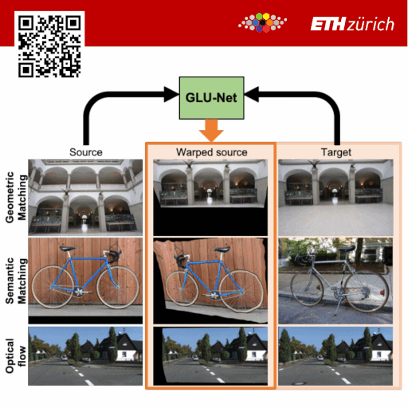

# <div align="center">GLU-Net: Global-Local Universal Network for dense flow and correspondences</div>
## <div align="center">CVPR 2020 - ORAL</div>
## <div align="center">Prune Truong, Martin Danelljan, Radu Timofte</div>





<figure inline style="width: 80%">
  
  <figcaption>GLU-Net architecture</figcaption>
</figure>

## Abstract
Establishing dense correspondences between a pair of images is an important and general problem, covering geometric matching, optical flow and semantic correspondences. While these applications share fundamental challenges, such as large displacements, pixel-accuracy, and appearance changes, they are currently addressed with specialized network architectures, designed for only one particular task. This severely limits the generalization capabilities of such networks to new scenarios, where e.g. robustness to larger displacements or higher accuracy is required.

In this work, we propose a universal network architecture that is directly applicable to all the aforementioned dense correspondence problems. We achieve both high accuracy and robustness to large displacements by investigating the combined use of global and local correlation layers. We further propose an adaptive resolution strategy, allowing our network to operate on virtually any input image resolution.
The proposed GLU-Net achieves state-of-the-art performance for geometric and semantic matching as well as optical flow, when using the same network and weights. Code and trained models are available [here](https://github.com/PruneTruong/GLU-Net).


## Visual Results:

* Aligning images of the ETH3D dataset

Here, we warp the source images toward the target image. We compare our GLU-Net to state-of-the-art optical flow method PWC-Net and geometric matching method DGC-Net. 

<div class="flex-row">
    <figure>
      
      <figcaption>Source images</figcaption>
    </figure>
    <figure>
      
      <figcaption>Target image</figcaption>
    </figure>
    <figure>
      
      <figcaption>**GLU-Net (Ours)**</figcaption>
    </figure>
    <figure>
      
      <figcaption>PWC-Net</figcaption>
    </figure>
    <figure>
      
      <figcaption>DGC-Net </figcaption>
    </figure>
</div>

<div class="flex-row">
    <figure>
      
      <figcaption>Source images</figcaption>
    </figure>
    <figure>
      
      <figcaption>Target image</figcaption>
    </figure>
    <figure>
      
      <figcaption>**GLU-Net (Ours)**</figcaption>
    </figure>
    <figure>
      
      <figcaption>PWC-Net</figcaption>
    </figure>
    <figure>
      
      <figcaption>DGC-Net </figcaption>
    </figure>
</div>


<div class="flex-row">
    <figure>
      
      <figcaption>Source images</figcaption>
    </figure>
    <figure>
      
      <figcaption>Target image</figcaption>
    </figure>
    <figure>
      
      <figcaption>**GLU-Net (Ours)**</figcaption>
    </figure>
    <figure>
      
      <figcaption>PWC-Net</figcaption>
    </figure>
    <figure>
      
      <figcaption>DGC-Net </figcaption>
    </figure>
</div>

* Aligning images of the HPatches dataset (homography dataset)


<div class="flex-row">
    <figure>
      
      <figcaption>Source images</figcaption>
    </figure>
    <figure>
      
      <figcaption>Target image</figcaption>
    </figure>
    <figure>
      
      <figcaption>**GLU-Net (Ours)**</figcaption>
    </figure>
    <figure>
      
      <figcaption>PWC-Net</figcaption>
    </figure>
    <figure>
      
      <figcaption>DGC-Net </figcaption>
    </figure>
</div>

<div class="flex-row">
    <figure>
      
      <figcaption>Source images</figcaption>
    </figure>
    <figure>
      
      <figcaption>Target image</figcaption>
    </figure>
    <figure>
      
      <figcaption>**GLU-Net (Ours)**</figcaption>
    </figure>
    <figure>
      
      <figcaption>PWC-Net</figcaption>
    </figure>
    <figure>
      
      <figcaption>DGC-Net </figcaption>
    </figure>
</div>
* Aligning images of the semantic matching dataset TSS

<figure>
  
</figure>


%`youtube: ltZpqRtuA6A`
## How to cite:
```
@inproceedings{GLUNet_Truong_2020,
      title = {{GLU-Net}: Global-Local Universal Network for dense flow and correspondences},
      author    = {Prune Truong and
                   Martin Danelljan and
                   Radu Timofte},
      year = {2020},
      booktitle = {2020 {IEEE} Conference on Computer Vision and Pattern Recognition, {CVPR} 2020}
}
```

