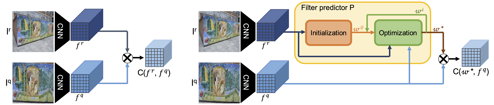
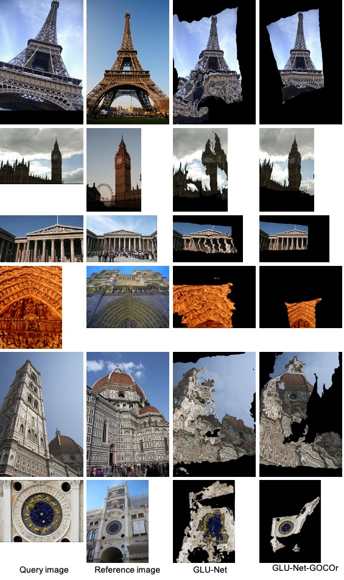
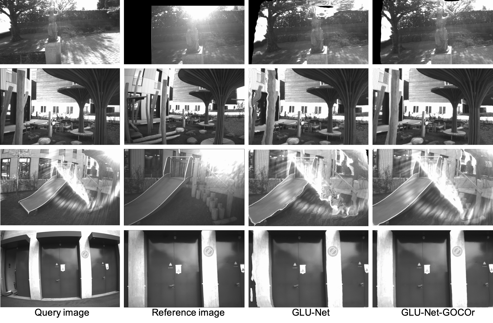
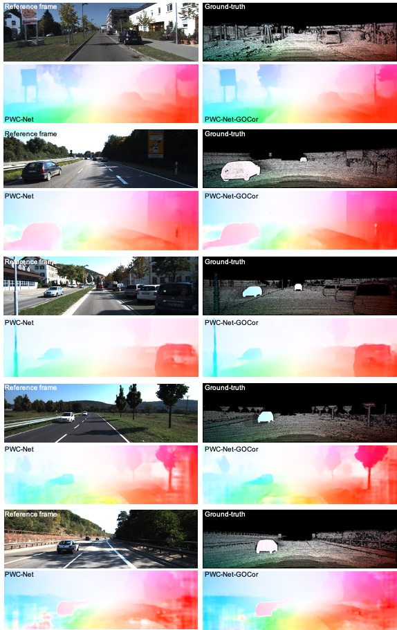
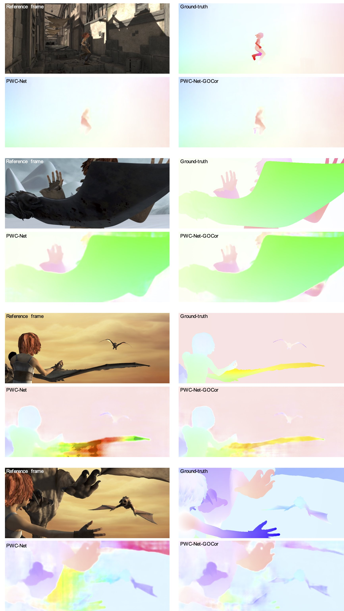

# <div align="center"><span style="color:MediumBlue">GOCor: Bringing Globally Optimized Correspondence Volumes into Your Neural Network</span></div>
## <div align="center"><span style="color:Blue">NeurIPS 2020</span></div>
#### <div align="center"><span style="color:MediumSlateBlue" >Prune Truong * &nbsp;&nbsp;&nbsp;&nbsp;&nbsp;&nbsp;&nbsp;&nbsp;&nbsp;&nbsp;&nbsp;&nbsp;<a href="https://martin-danelljan.github.io/"  style="text-decoration: none;color: MediumSlateBlue">Martin Danelljan</a> * &nbsp;&nbsp;&nbsp;&nbsp;&nbsp;&nbsp;&nbsp;&nbsp;&nbsp;&nbsp;&nbsp;&nbsp;<a href="https://ee.ethz.ch/the-department/faculty/professors/person-detail.OTAyMzM=.TGlzdC80MTEsMTA1ODA0MjU5.html"  style="text-decoration: none;color: MediumSlateBlue">Luc Van Gool</a> &nbsp;&nbsp;&nbsp;&nbsp;&nbsp;&nbsp;&nbsp;&nbsp;&nbsp;&nbsp;&nbsp;&nbsp;<a href="http://people.ee.ethz.ch/~timofter/"  style="text-decoration: none;color: MediumSlateBlue">Radu Timofte</a></span></div>


<hr style="border:0.01px solid LightGray"> </hr>

<div align="center"><a href="https://arxiv.org/abs/2009.07823"  style="text-decoration: none;color: DarkBlue;"><b>Paper</b></a>&nbsp;&nbsp;&nbsp;&nbsp;&nbsp;&nbsp;&nbsp;&nbsp;&nbsp;&nbsp;&nbsp;&nbsp;&nbsp;&nbsp;&nbsp;&nbsp;&nbsp;&nbsp;&nbsp;&nbsp;&nbsp;&nbsp;&nbsp;&nbsp;&nbsp;&nbsp;&nbsp;&nbsp;&nbsp;&nbsp;&nbsp;&nbsp;&nbsp;&nbsp;&nbsp;&nbsp;&nbsp;&nbsp;&nbsp;&nbsp;&nbsp;&nbsp;&nbsp;&nbsp;&nbsp;&nbsp;&nbsp;&nbsp;&nbsp;&nbsp;&nbsp;&nbsp;&nbsp;&nbsp;&nbsp;&nbsp;&nbsp;&nbsp;&nbsp;&nbsp;&nbsp;&nbsp;<a href="https://github.com/PruneTruong/GOCor" style="text-decoration: none;color: DarkBlue;"><b>Code</b></a> &nbsp;&nbsp;&nbsp;&nbsp;&nbsp;&nbsp;&nbsp;&nbsp;&nbsp;&nbsp;&nbsp;&nbsp;&nbsp;&nbsp;&nbsp;&nbsp;&nbsp;&nbsp;&nbsp;&nbsp;&nbsp;&nbsp;&nbsp;&nbsp;&nbsp;&nbsp;&nbsp;&nbsp;&nbsp;&nbsp;&nbsp;&nbsp;&nbsp;&nbsp;&nbsp;&nbsp;&nbsp;&nbsp;&nbsp;&nbsp;&nbsp;&nbsp;&nbsp;&nbsp;&nbsp;&nbsp;&nbsp;&nbsp;&nbsp;&nbsp;&nbsp;&nbsp;&nbsp;&nbsp;&nbsp;&nbsp;&nbsp;&nbsp;&nbsp;&nbsp;&nbsp;&nbsp;&nbsp;
<a href="https://www.youtube.com/watch?v=V22MyFChBCs&feature=youtu.be"  style="text-decoration: none;color: DarkBlue "><b>Video</b></a></div>


<hr style="border:0.01px solid LightGray"> </hr>

<figure inline class=scaled style="width: 100%">
  
  <figcaption>Visualization of the matching confidences computed between the indicated location (green) in the reference image and all locations of either the reference image itself or the query image.  The feature correlation generates undistinctive and inaccurate confidences due to similar regions and repetitive patterns. In contrast, our <b>GOCor</b> predicts a distinct high-confidence value at the correct location. </figcaption>
</figure>


## Abstract
The feature correlation layer serves as a key neural network module in numerous computer vision problems that involve dense correspondences between image pairs. It predicts a correspondence volume by evaluating dense scalar products between feature vectors extracted from pairs of locations in two images.
However, this point-to-point feature comparison is insufficient when disambiguating multiple similar regions in an image, severely affecting the performance of the end task.
We propose GOCor, a fully differentiable dense matching module, acting as a direct replacement to the feature correlation layer.
The correspondence volume generated by our module is the result of an internal optimization procedure that explicitly accounts for similar regions in the scene. Moreover, our approach is capable of effectively learning spatial matching priors to resolve further matching ambiguities.
We analyze our GOCor module in extensive ablative experiments. When integrated into state-of-the-art networks, our approach significantly outperforms the feature correlation layer for the tasks of geometric matching, optical flow, and dense semantic matching. The code and trained models will be made available [here](https://github.com/PruneTruong/GOCor).


<figure inline style="width: 100%">
  
  <figcaption>Schematic overview of the feature correlation layer (a) and our GOCor module (b). </figcaption>
</figure>

## Visual Results:

* #### Aligning images of the MegaDepth dataset

Here, we warp the query image toward the reference image. We compare our GLU-Net-GOCor with original network GLU-Net. 

<figure inline style="width: 100%">
  
</figure>


* #### Aligning images of the ETH3D dataset

Here, we warp the query image toward the reference image. We compare our GLU-Net to state-of-the-art optical flow method PWC-Net and geometric matching method DGC-Net. 

<figure inline style="width: 100%">
  
</figure>

* #### Aligning images of the KITTI dataset (optical flow dataset)


<figure inline style="width: 100%">
  
</figure>

* #### Aligning images of the Sintel dataset (optical flow dataset)

<figure inline style="width: 100%">
  
</figure>


## How to cite:
```
@inproceedings{GOCor_Truong_2020,
      title = {{GOCor}: Bringing Globally Optimized Correspondence Volumes into Your Neural Network},
      author    = {Prune Truong 
                   and Martin Danelljan 
                   and Luc Van Gool 
                   and Radu Timofte},
      year = {2020},
      booktitle = {Advances in Neural Information Processing Systems 33: Annual Conference on Neural Information
                   Processing Systems 2020, {NeurIPS} 2020}
}
```

