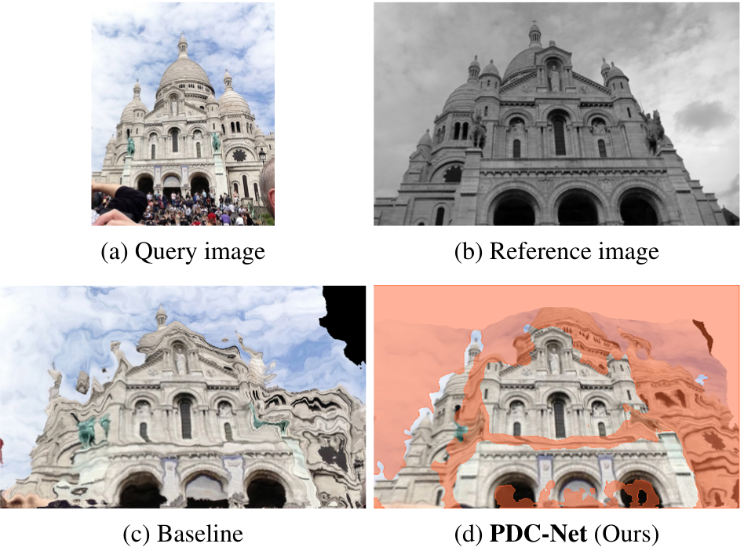
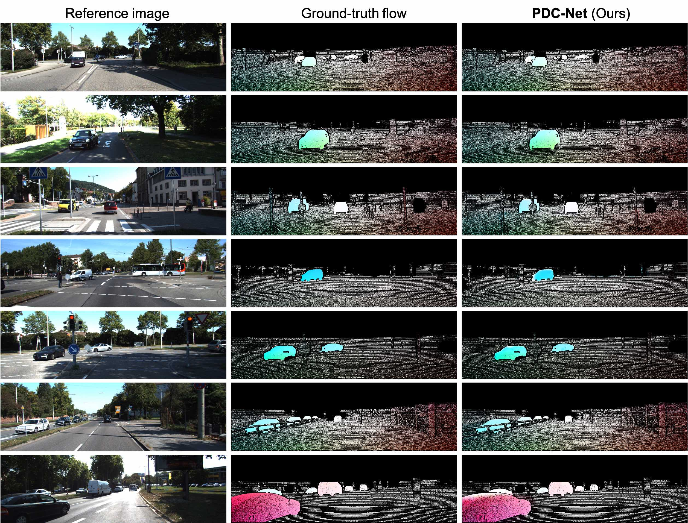

# <div align="center"><span style="color:MediumBlue">Learning Accurate Dense Correspondences and When to Trust Them</span></div>
## <div align="center"><span style="color:Blue">CVPR 2021 - </span><span style="color:Red">ORAL</span></div>
###<div align="center"><span style="color:MediumSlateBlue" >Prune Truong &nbsp;&nbsp;&nbsp;&nbsp;&nbsp;&nbsp;&nbsp;&nbsp;&nbsp;&nbsp;&nbsp;&nbsp;<a href="https://martin-danelljan.github.io/"  style="text-decoration: none;color: MediumSlateBlue">Martin Danelljan</a> &nbsp;&nbsp;&nbsp;&nbsp;&nbsp;&nbsp;&nbsp;&nbsp;&nbsp;&nbsp;&nbsp;&nbsp;<a href="https://ee.ethz.ch/the-department/faculty/professors/person-detail.OTAyMzM=.TGlzdC80MTEsMTA1ODA0MjU5.html"  style="text-decoration: none;color: MediumSlateBlue">Luc Van Gool</a> &nbsp;&nbsp;&nbsp;&nbsp;&nbsp;&nbsp;&nbsp;&nbsp;&nbsp;&nbsp;&nbsp;&nbsp;<a href="http://people.ee.ethz.ch/~timofter/"  style="text-decoration: none;color: MediumSlateBlue">Radu Timofte</a></span></div>

<hr style="border:0.01px solid LightGray"> </hr>

<div style="display: flex;justify-content: space-around;width:100%">
	<div><a href="https://arxiv.org/abs/2101.01710"  style="text-decoration: none;color: DarkBlue;"><b>Paper</b></a></div>
	<div><a href="https://youtu.be/bX0rEaSf88o"  style="text-decoration: none;color: DarkBlue "><b>Video</b></a></div>
	<div><a href="https://github.com/PruneTruong/PDCNet" style="text-decoration: none;color: DarkBlue;"><b>Code</b></a></div>
	<div><a href="https://drive.google.com/file/d/18ya__AdEIgZyix8dXuRpJ15tdrpbMUsB/view?usp=sharing" style="text-decoration: none;color: DarkBlue;"><b>Poster</b></a></div>
	<div><a href="https://drive.google.com/file/d/1zUQmpmVp6WSa_psuI3KFvKVrNyJE-beG/view?usp=sharing" style="text-decoration: none;color: DarkBlue;"><b>Slides</b></a></div>
</div>

<hr style="border:0.01px solid LightGray"> </hr>


<figure inline style="width: 100%">
  
  <figcaption style="text-align: center">Estimating dense correspondences between the query (a) and the reference (b) image. The query is warped according to the resulting flows (c)-(d).
The baseline (c) does not estimate an uncertainty map and is therefore unable to filter the inaccurate flows at, for example occluded and homogeneous regions. In contrast, our PDC-Net (d) not only estimates accurate correspondences, but also when to trust them. It predicts a robust uncertainty map that identifies accurate matches and excludes incorrect and unmatched pixels (red).</figcaption>
</figure>


## Abstract
Establishing dense correspondences between a pair of images is an important and general problem. However, dense flow estimation is often inaccurate in the case of large displacements or homogeneous regions. For most applications and down-stream tasks, such as pose estimation, image manipulation, or 3D reconstruction, it is crucial to know when and where to trust the estimated correspondences. 

In this work, we aim to estimate a dense flow field relating two images, coupled with a robust pixel-wise confidence map indicating the reliability and accuracy of the prediction. We develop a flexible probabilistic approach that jointly learns the flow prediction and its uncertainty. In particular, we parametrize the predictive distribution as a constrained mixture model, ensuring better modelling of both accurate flow predictions and outliers. Moreover, we develop an architecture and training strategy tailored for robust and generalizable uncertainty prediction in the context of self-supervised training. Our approach obtains state-of-the-art results on multiple challenging geometric matching and optical flow datasets. We further validate the usefulness of our probabilistic confidence estimation for the task of pose estimation. Code and models will be released [here](https://github.com/PruneTruong/PDCNet).


<b>Check out <a href="https://prunetruong.com/research/pdcnet+"  style="text-decoration: none;color: DarkBlue;">PDC-Net+</a> for a better network and more visualization!</b>


## Visual Results:

* #### Aligning images of the Aachen city

Here, we warp the query images toward the reference images. Our approch PDC-Net also predicts a confidence mask along with the dense correspondences. We show the warped query only in the estimated confident regions. 

<figure>

<figcaption style="display: flex;justify-content: space-around;width:100%"> <div>Query</div> <div>Reference</div> <div><b>PDC-Net</b></div></figcaption>
</figure>


* #### Aligning eth3d sequences

Here, we warp the query images toward the reference images. Our approch PDC-Net also predicts a confidence mask along with the dense correspondences. We show the warped query only in the estimated confident regions. 

<figure>

<figcaption style="display: flex;justify-content: space-around;width:100%"> <div>Query</div> <div>Reference</div> <div><b>PDC-Net</b></div></figcaption>
</figure>

<figure>

<figcaption style="display: flex;justify-content: space-around;width:100%"> <div>Query</div> <div>Reference</div> <div><b>PDC-Net</b></div></figcaption>
</figure>

<figure>

<figcaption style="display: flex;justify-content: space-around;width:100%"> <div>Query</div> <div>Reference</div> <div><b>PDC-Net</b></div></figcaption>
</figure>


<figure>

<figcaption style="display: flex;justify-content: space-around;width:100%"> <div>Query</div> <div>Reference</div> <div><b>PDC-Net</b></div></figcaption>
</figure>


<figure>

<figcaption style="display: flex;justify-content: space-around;width:100%"> <div>Query</div> <div>Reference</div> <div><b>PDC-Net</b></div></figcaption>
</figure>


<figure>

<figcaption style="display: flex;justify-content: space-around;width:100%"> <div>Query</div> <div>Reference</div> <div><b>PDC-Net</b></div></figcaption>
</figure>

<figure>

<figcaption style="display: flex;justify-content: space-around;width:100%"> <div>Query</div> <div>Reference</div> <div><b>PDC-Net</b></div></figcaption>
</figure>

<figure>

<figcaption style="display: flex;justify-content: space-around;width:100%"> <div>Query</div> <div>Reference</div> <div><b>PDC-Net</b></div></figcaption>
</figure>


* #### Texture transfer

<figure>

<figcaption style="display: flex;justify-content: space-around;width:100%"> <div>Query</div> <div>Reference</div> <div><b>PDC-Net</b></div></figcaption>
</figure>


or with larger appearance transformations...

<figure>

<figcaption style="display: flex;justify-content: space-around;width:100%"> <div>Query</div> <div>Reference</div> <div><b>PDC-Net</b></div></figcaption>
</figure>

<figure>

<figcaption style="display: flex;justify-content: space-around;width:100%"> <div>Query</div> <div>Reference</div> <div><b>PDC-Net</b></div></figcaption>
</figure>


* #### Aligning images of KITTI-2015

We here show qualitative examples of our approach PDC-Net applied to images of KITTI-2015. We plot directly the estimated flow field for each image pair.
<figure inline style="max-width: 100%; width: 100%">
  
</figure>


* #### Aligning images of MegaDepth

We show qualitative examples of our approach PDC-Net and corresponding non-probabilistic baseline GLU-Net-GOCor\*, applied to images of the MegaDepth dataset. In the 3rd and 4th columns, we visualize the query images warped according to the flow fields estimated by the GLU-Net-GOCor* and PDC-Net respectively. PDC-Net also predicts a confidence map, according to which the regions represented in red, are unreliable or inaccurate matching regions. In the last column, we overlay the reference image with the warped query from PDC-Net, in the identified accurate matching regions (lighter color).
<figure inline style="max-width: 100%; width: 100%">
  
</figure>

* #### 3D reconstruction of Aachen


<figure inline style="max-width: 100%; width: 100%">
  
</figure>

## How to cite:
```
@inproceedings{pdcnet,
  author    = {Prune Truong and
               Martin Danelljan and
               Luc Van Gool and
               Radu Timofte},
  title     = {Learning Accurate Dense Correspondences and When to Trust Them},
  booktitle = {{IEEE/CVF} Conference on Computer Vision and Pattern Recognition, {CVPR}},
  year      = {2021},
  url       = {https://arxiv.org/abs/2101.01710}
}
```

